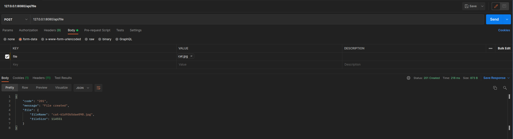
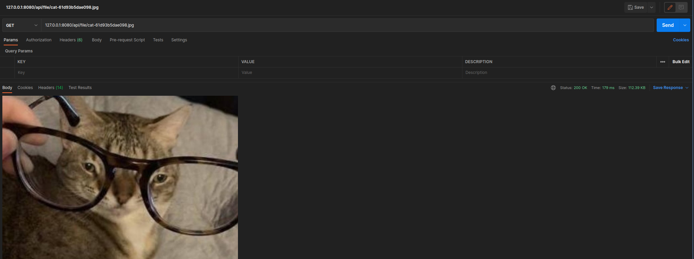
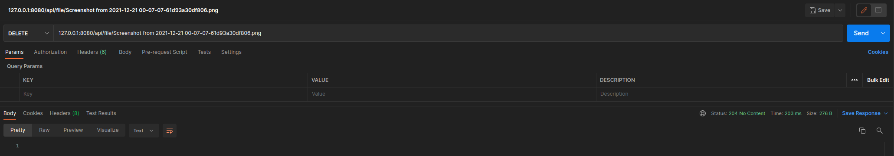
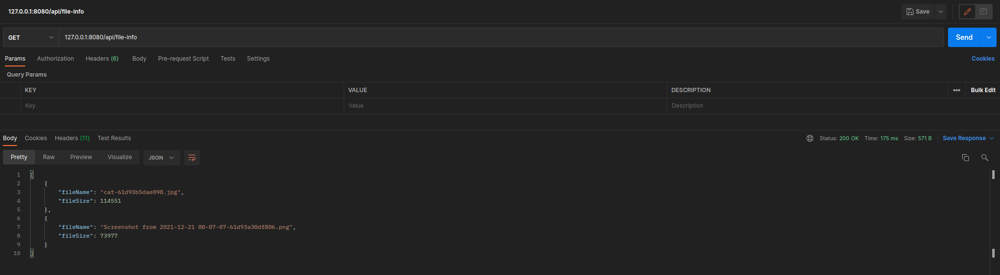

# storage-server
Web-приложение, позволяющее выгружать файлы на сервер, скачивать его, а также удалять. 

### POST /api/file
Загрузка файла.

### GET /api/file/{filename}
Скачивание файла. 

### DELETE /api/file/{filename}
Удаление файла.

### GET /api/file-info/
Информация о всех файлах: название и размер в байтах. 

